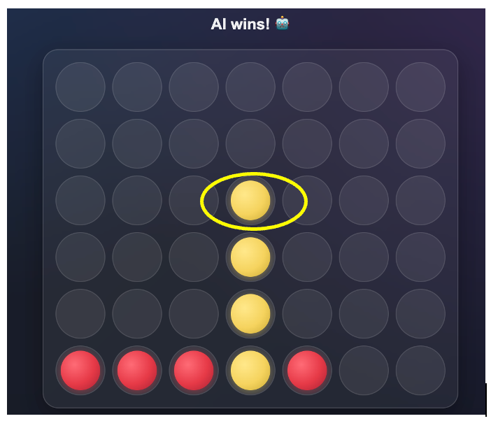
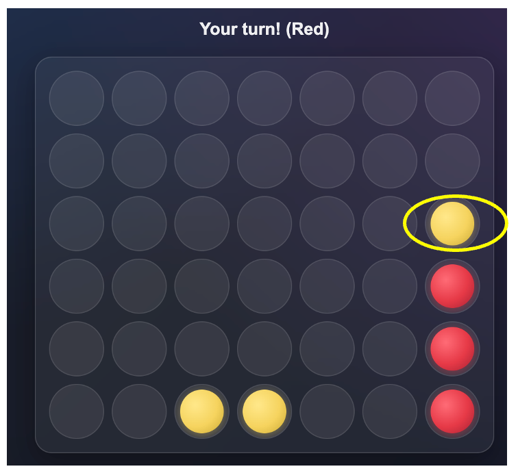
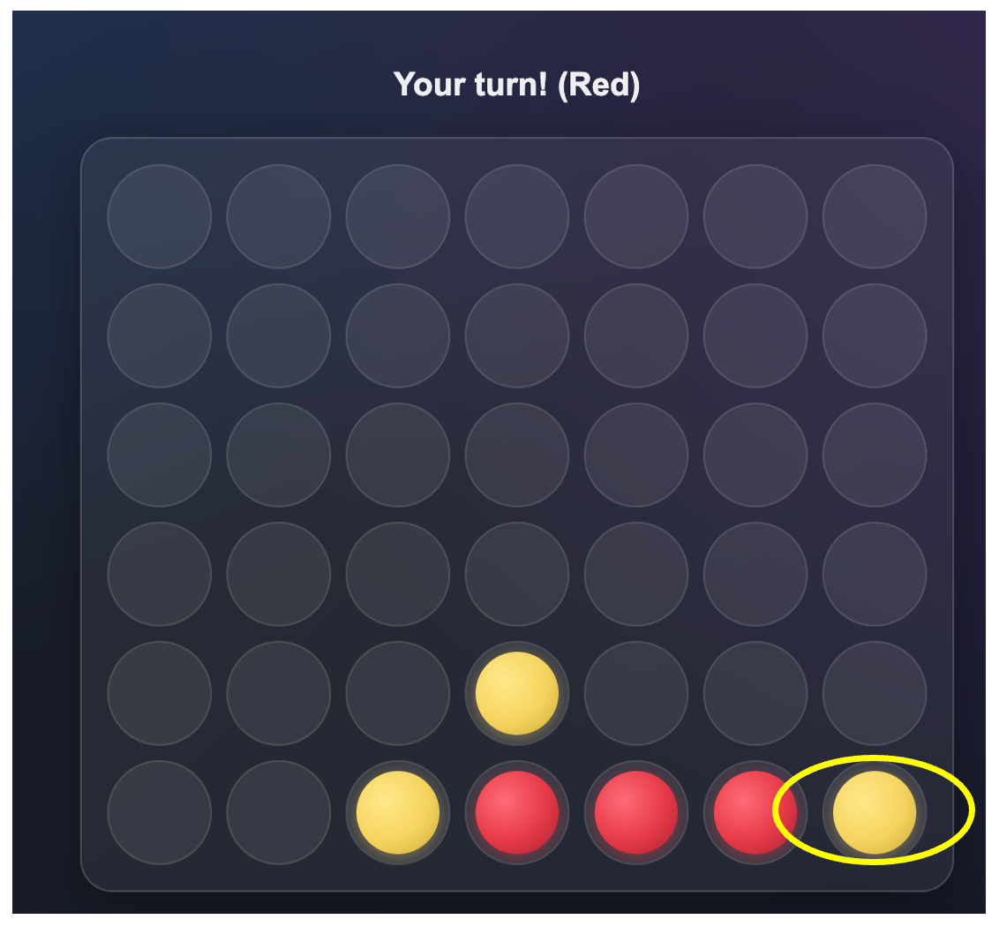
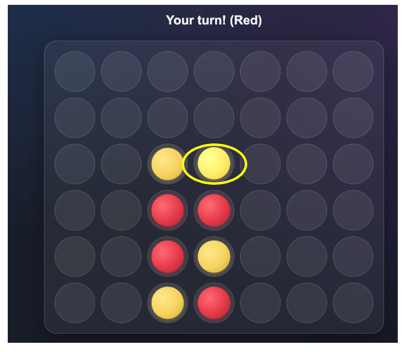
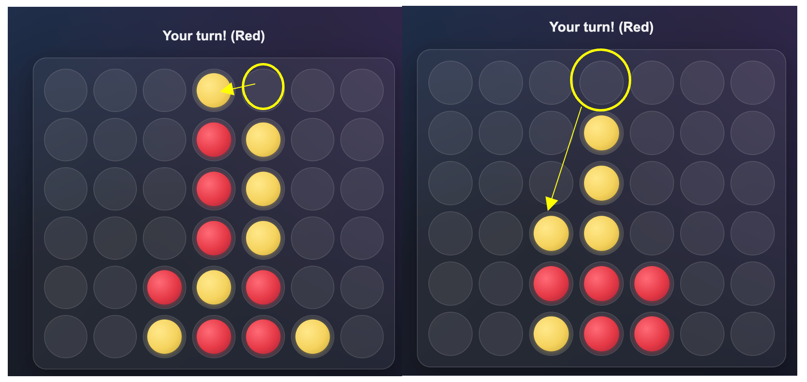

# Connect 4 AI Arena — Stage 1: Full-Stack Deployment

A full-stack Connect 4 platform where users play against two AI opponents — a CNN and a Transformer — that were trained entirely on self-generated data. Instead of relying on an existing dataset, we generated our own training positions through Monte Carlo Tree Search (MCTS) self-play, trained both models to imitate that play, and deployed them as live opponents through a Dockerized backend connected to an Anvil web front end.

**Team:** Nikhil Kumar (Anvil, CSS, Python, MCTS dataset) · Franco Salinas (CNN, MCTS dataset, modeling, evaluation) · Muzaffar Yezdan (Docker, AWS, backend, deployment) · Justin Yang (Transformer, modeling, training, evaluation)
*Team project completed as part of the MSBA program at the McCombs School of Business, UT Austin.*

## Demo Status

The live app was deployed on AWS Lightsail during the project but has since been taken down to avoid ongoing hosting costs. The screenshots below (`docs/screenshots/`) are real gameplay captures from when it was running. The Anvil app itself can still be cloned from the link below — this gives you the front-end UI code, but not a running AI opponent unless you also deploy the backend in `deployment/` yourself.

- Anvil app (view/clone): https://anvil.works/build#clone:F72NZR4PSMSKVWOA=KGQ7WAMJPAKQ254CPZYNNCIE

## Gameplay Examples

| Immediate winning move | Blocking an opponent's win |
|---|---|
|  |  |

| Blocking a horizontal threat | Center control (no immediate tactic) |
|---|---|
|  |  |

The model isn't perfect — the case below shows it choosing a safe blocking move on the top row instead of a cleaner win, a pattern that showed up more often in top-row endgames than elsewhere:



## Architecture

The system has four layers, each independently swappable:

1. **Self-play data generation** — MCTS plays against itself thousands of times; the board state, MCTS's recommended move, and game outcome are recorded for every position.
2. **Model training** — a CNN and a Transformer are each trained to predict MCTS's recommended move from the board state.
3. **Backend inference** — a Docker-containerized Python service loads both trained models and exposes them as callable functions.
4. **Frontend** — an Anvil web app handles the board UI, game state, and opponent selection, and calls the backend over Anvil's Uplink protocol.

## Self-Play Data Generation

Two dataset versions were generated as the pipeline was tuned; the model reported below was trained on the larger, stronger **NEW** dataset.

| Dataset | Games | MCTS Steps/Move | Random Opening Moves | Total Positions | Train | Val | Test |
|---|---|---|---|---|---|---|---|
| OLD | 4,000 | 800 | 6 | 98,755 | 79,004 | 9,875 | 9,876 |
| NEW | 5,500 | 1,500 | 4 | 123,476 | 98,780 | 12,347 | 12,349 |

A few pipeline details worth noting:
- MCTS is stochastic, so the same board position can get slightly different "best move" labels across games. Duplicate positions were deduplicated by majority vote — the most frequently recommended move for a given position was kept as its label.
- Boards are encoded as a two-channel 6×7×2 array for the CNN (channel 0 = current player's pieces, channel 1 = opponent's) rather than a single channel with +1/-1 values, since separating players into different feature maps made it easier for the convolutional filters to learn vertical, horizontal, and diagonal patterns independently for each side.

Notebook: [`notebooks/01_mcts_data_generation.ipynb`](./notebooks/01_mcts_data_generation.ipynb)

## CNN Model

**Architecture:** three stacked 3×3 convolutional layers (96 → 96 → 48 filters) with batch normalization and ReLU, followed by dropout (0.25), a 256-unit dense layer, and a 7-way softmax output (one per column). L2 regularization (1e-4) on all weight layers. Trained with Adam (lr = 1e-3) and sparse categorical cross-entropy, with early stopping and learning-rate reduction on plateau.

**Total parameters:** 645,495 (verified via `model.summary()`)

**Accuracy — three different numbers, three different things:**

| Metric | Value | What it actually measures |
|---|---|---|
| Validation accuracy (epoch 13 checkpoint) | 60.57% | Accuracy on the validation split at the specific training checkpoint used for production. This checkpoint was chosen for having the best validation *loss* (1.0882), not the best validation accuracy — accuracy kept climbing through epoch 18, but validation loss got worse after epoch 13, indicating mild overfitting past that point. |
| Test accuracy — Top-1 | 60.73% | Exact-match accuracy on the fully held-out test set (12,349 positions never seen during training). Reproducible by rerunning the final evaluation cell in `02_cnn_training.ipynb`. |
| Test accuracy — Top-3 | 90.73% | How often the MCTS-labeled "true" move appears among the model's three highest-probability predictions. This is a more forgiving and arguably more meaningful metric here, since Connect 4 positions frequently have more than one near-optimal move — Top-1 accuracy penalizes the model equally for picking the "wrong" move even when it was just as good as the labeled one. |

All three numbers are legitimate and don't conflict — they're measuring different things at different points in the process.

**Gameplay performance vs. live MCTS opponents**, comparing the model trained on the OLD dataset to the one trained on the NEW dataset, playing 100 games at each MCTS strength level:

| Opponent Strength (MCTS steps) | OLD Model Win Rate | NEW Model Win Rate |
|---|---|---|
| 50 | 77% | 89% |
| 100 | 65% | 75% |
| 200 | 55% | 55% |

Win rate held up whether the model played first or second — at MCTS-50, the NEW model won 86% of games playing first and 92% playing second, both clear improvements over the OLD model's 70% / 84%. Performance converges toward the OLD model's at MCTS-200, which lines up with the Top-1 accuracy plateau above: without any lookahead at inference time, a pure move-classifier has a ceiling against a sufficiently deep search opponent.

Notebook: [`notebooks/02_cnn_training.ipynb`](./notebooks/02_cnn_training.ipynb)

## Transformer Model

**Architecture:** a Vision Transformer (ViT) adapted for Connect 4's 6×7 board, based on a ViT template introduced in coursework and extended for this project. Each of the 42 board cells is treated as a token (value -1/0/+1), projected to a 64-dimensional embedding, with a learned positional encoding and a prepended learnable class token. Four transformer blocks (multi-head self-attention, feed-forward, layer norm, residual connections), 4 attention heads, ~143,000 total parameters — roughly a fifth the size of the CNN.

**Training:** same 123,476-position dataset as the CNN's NEW dataset (80/20 train/val split), Adam optimizer, batch size 128, up to 50 epochs with early stopping, trained on a Colab T4 GPU (~60 minutes).

**Final validation accuracy: 46.05%** — well above the random baseline (14.3%) and the always-predict-most-common baseline (16.6%), but clearly behind the CNN. Using the CNN's directly comparable, reproducible test accuracy (60.73%), the CNN outperformed the Transformer on this task by a wide margin — though it's worth noting the two models weren't evaluated through an identical script (the CNN number is Top-1 test-set accuracy; the Transformer number is validation accuracy from its own training run), so treat the gap as directionally accurate rather than a precise apples-to-apples delta.

**Why the CNN likely had the edge here:** Connect 4 is a small, spatially local board (only 42 cells), which plays to a CNN's built-in strengths — its convolutional filters have spatial pattern-matching (local receptive fields, translation invariance) baked in as an inductive bias. A Transformer has to learn spatial relationships from data instead of getting them for free, and self-attention is arguably underused on an input this small compared to the large images or long text sequences it's typically applied to. Both models are also purely supervised move-classifiers with no lookahead at inference time, which caps how well either can play against strong search-based opponents.

Notebook: [`notebooks/03_transformer_training.ipynb`](./notebooks/03_transformer_training.ipynb)

## Deployment: Docker + Anvil + AWS Lightsail

The backend is containerized and runs as two redundant replicas, each connecting to the Anvil front end via an Anvil Uplink key:

- **`requirements.txt`** — pinned dependency versions (`tensorflow==2.19.0`, `anvil-uplink==0.3.36`, `numpy==2.0.2`)
- **`Dockerfile`** — base Python 3.12 image, installs dependencies, copies in `server.py` and both trained models
- **`docker-compose.yml`** — defines the two uplink replicas; reads Anvil Uplink keys from environment variables (see `.env.example`) rather than hardcoding them
- **`server.py`** — loads both models, converts incoming board state from the frontend into each model's expected input format, and exposes `cnn_best_move()` and `transformer_best_move()` as Anvil-callable functions

The finished container was hosted on AWS Lightsail during the project (see `docs/deployment_terminal.jpg` for the running containers), giving the Anvil frontend a persistent backend to call for live move predictions.

### Running it yourself

```bash
cd deployment
cp .env.example .env
# then fill in your own Anvil Uplink key(s) in .env
docker compose up --build
```

## Repository Structure

```
stage-1-full-stack-deployment/
├── README.md
├── notebooks/
│   ├── 01_mcts_data_generation.ipynb
│   ├── 02_cnn_training.ipynb
│   └── 03_transformer_training.ipynb
├── deployment/
│   ├── Dockerfile
│   ├── docker-compose.yml
│   ├── .env.example
│   ├── requirements.txt
│   ├── server.py
│   └── models/
│       ├── cnnmodel2.h5
│       └── transformer2.keras
└── docs/
    ├── project_writeup.pdf
    ├── deployment_terminal.jpg
    └── screenshots/
```

## Lessons Learned

- **Top-1 accuracy plateaus around 60% not because the model is weak, but because Connect 4 positions often have multiple near-equally good moves** — a single-best-move label creates label noise the model can't fully resolve. Top-3 accuracy (90.73%) shows the model consistently ranks the correct move highly even when it doesn't rank it first.
- **The CNN's spatial inductive bias mattered more than the Transformer's larger effective context window** on a board this small — a hybrid CNN-Transformer approach was identified as a promising direction for future work.
- **Neither model has lookahead at inference time**, which is the main structural ceiling on gameplay strength against deep-searching opponents like MCTS-200, regardless of architecture.

## Tech Stack

Python · TensorFlow/Keras · NumPy · Docker · Docker Compose · Anvil (Uplink + web frontend) · AWS Lightsail · Google Colab (Tesla T4 GPU)

## Full Project Write-Up

A complete write-up with architecture diagrams, training curves, and detailed board-position analysis is available at [`docs/project_writeup.pdf`](./docs/project_writeup.pdf).
